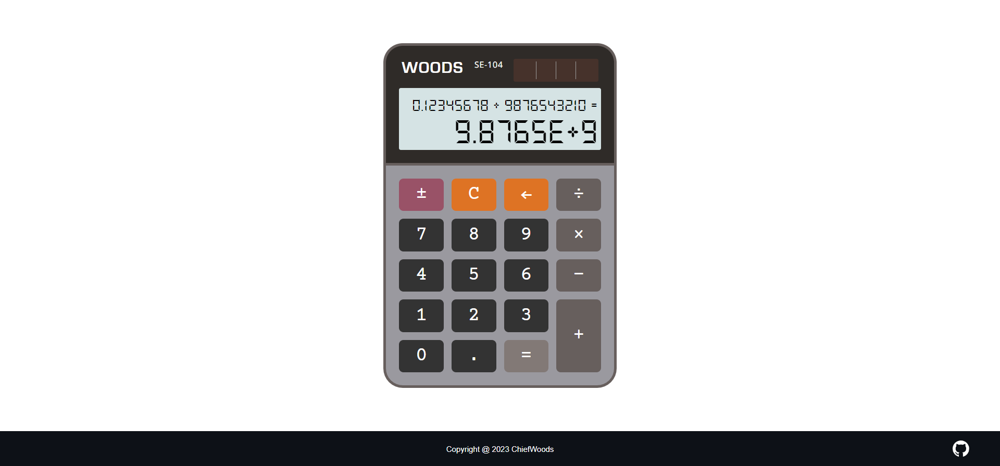

# Calculator



Web calculator for [The Odin Project](https://www.theodinproject.com/) and [freeCodeCamp](https://www.freecodecamp.org/learn/).

[Live Website](https://chiefwoods.github.io/calculator/)  

[Source Repository](https://github.com/ChiefWoods/calculator)

## Features

- Perform basic arithmetic operations
- Toggle between positive and negative numbers
- Backspace available
- Chainable operations
- Keyboard and numpad support

## Built With

### Tools and Languages

- [](https://html5.org/)
- [](https://www.w3.org/Style/CSS/Overview.en.html)
- [](https://js.org/index.html)

## Getting Started

### Setup

Clone the repository.

```
git clone https://github.com/ChiefWoods/calculator.git
```

## Issues

View the [open issues](https://github.com/ChiefWoods/calculator/issues) for a full list of proposed features and known bugs.

## Acknowledgements

### Resources

- [Shields.io](https://shields.io/)
- [Google Fonts](https://fonts.google.com/)
- [DaFont](https://www.dafont.com/)
- [Pictogrammers](https://pictogrammers.com/)

### Hosting

- [GitHub Pages](https://pages.github.com/)

## Contact

[chii.yuen@hotmail.com](mailto:chii.yuen@hotmail.com)
